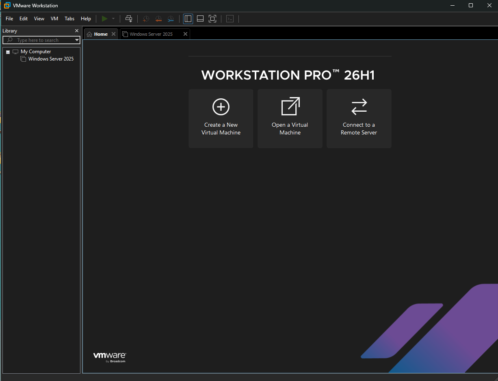
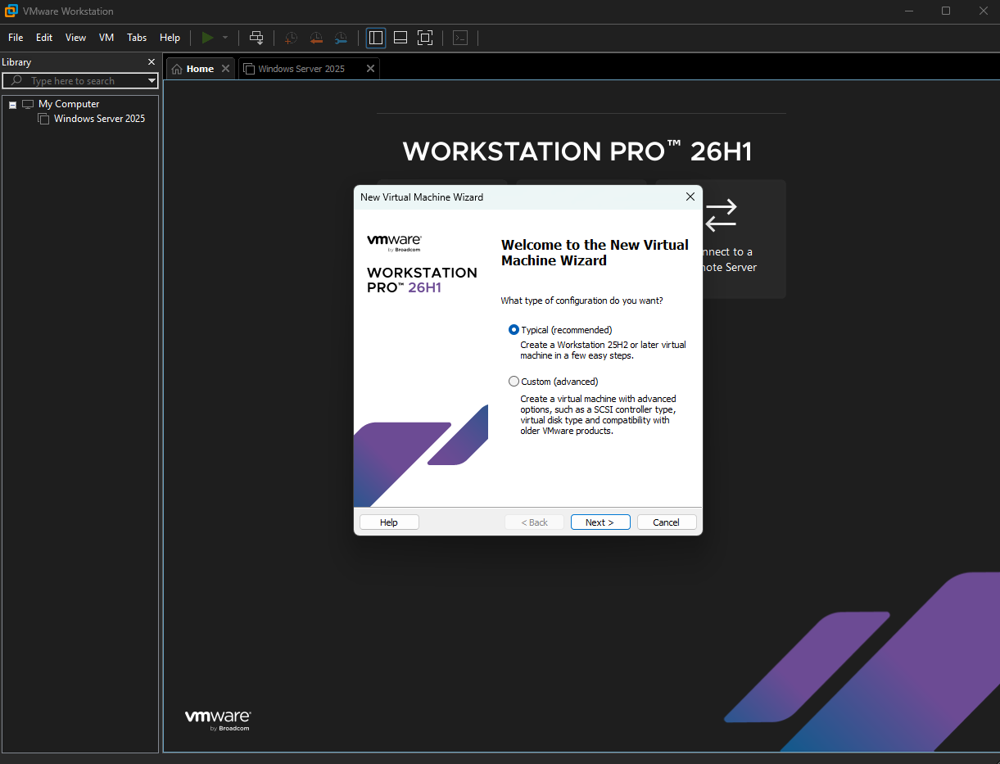
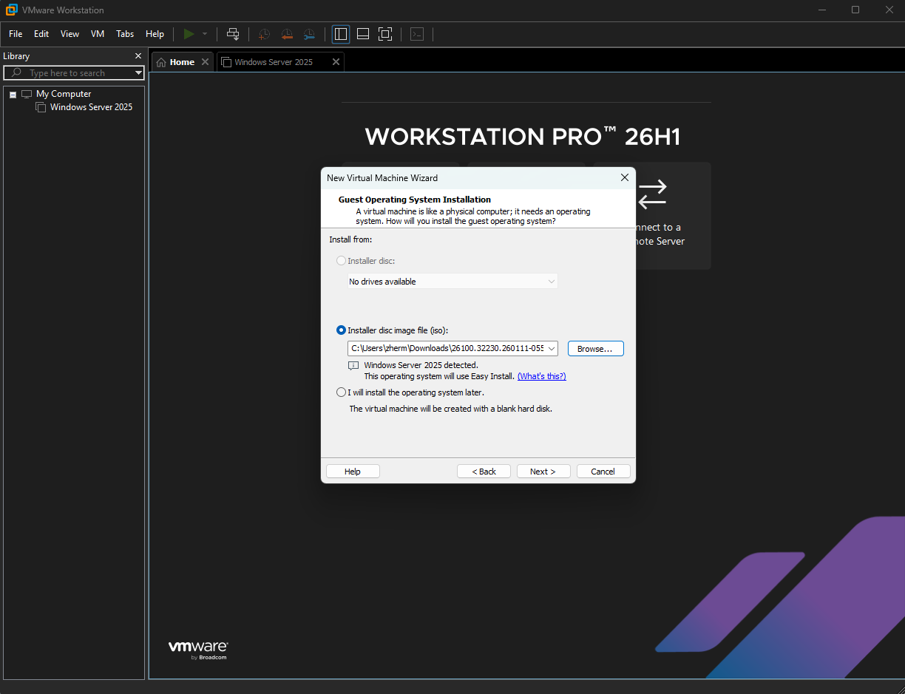
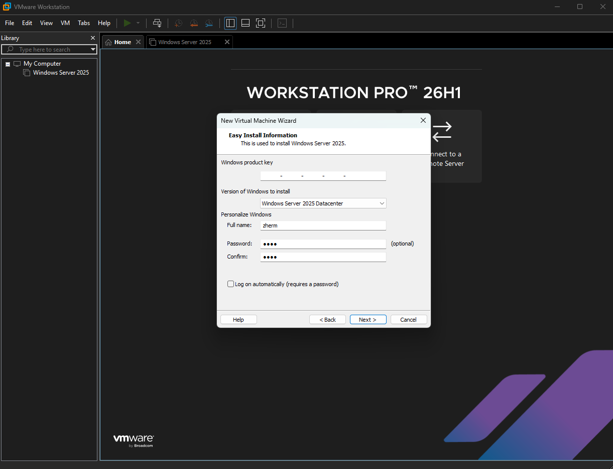
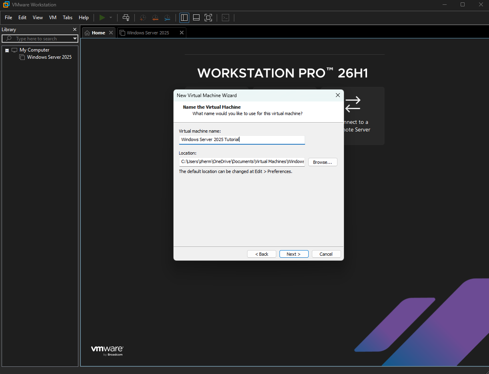
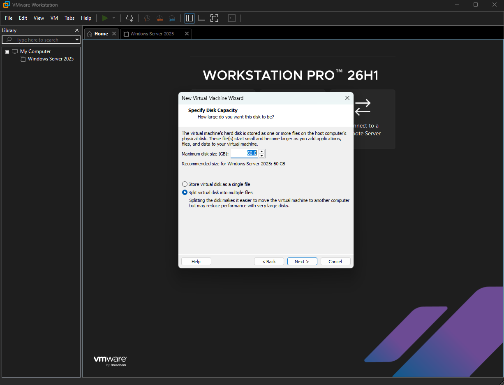
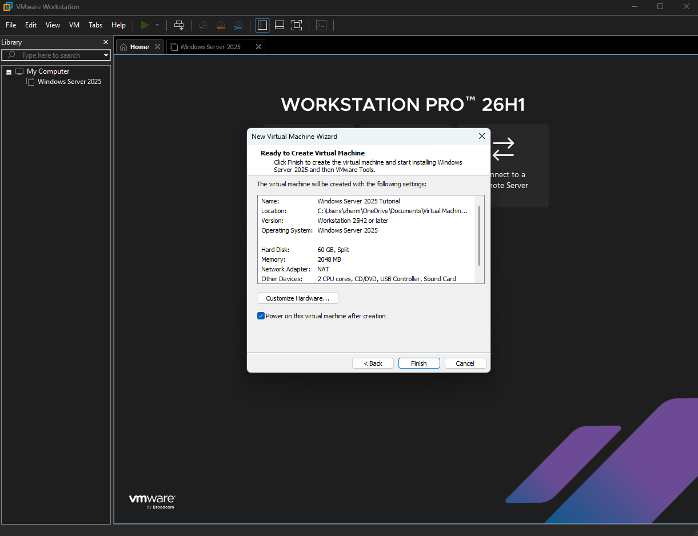
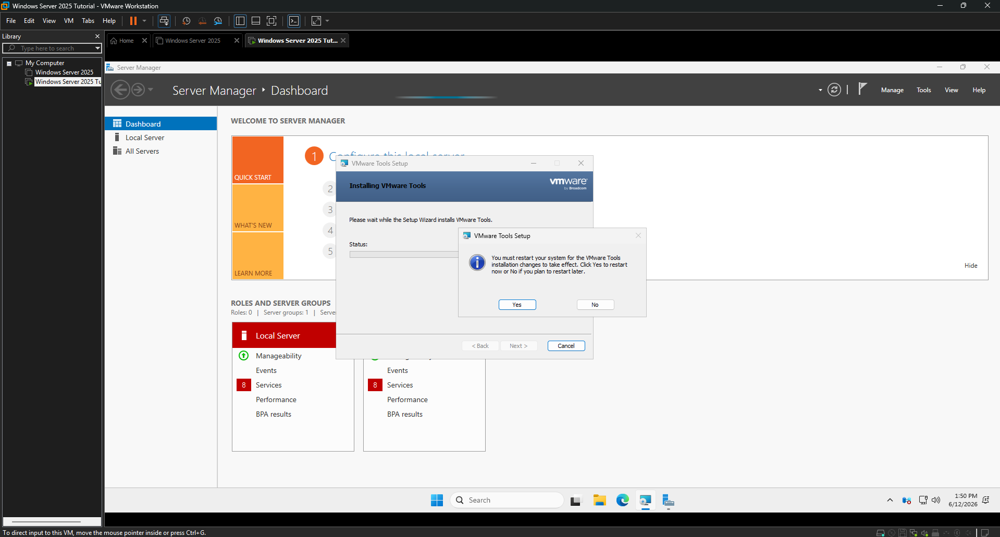
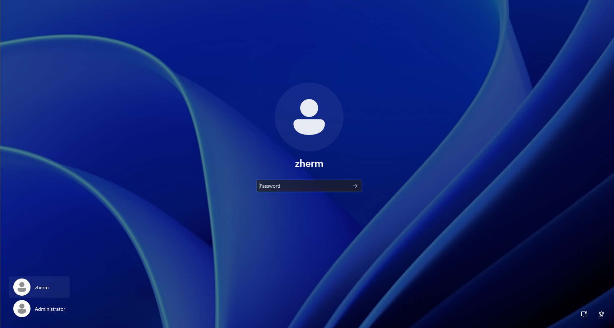
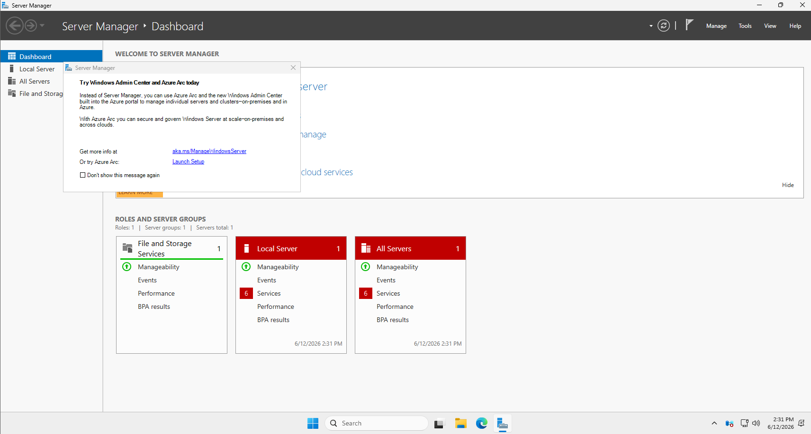

# 01 - Initial Setup

We will be running our home lab on a virtual machine, we will be using vm worksation pro26H1.

Link: https://support.broadcom.com/group/ecx/productdownloadssubfamily=VMware%20Workstation%20Pro&freeDownloads=true

Next you need to get the .iso file for windows server 2025, Microsoft offers a free license for 6 months which should be more than enough time.

Link: https://www.microsoft.com/en-us/evalcenter/evaluate-windows-server-2025

Once you have both now we can get started with setting up windows server.

## Setting up our VM image

Once you install Vmware workstation it should look similar to this, now click Create a New Virtual Machine

Now click typical and click next

Here you'll need to press Installer disc image file (iso) and click browse and click on iso for windows server that you downloaded. You should see that it detects Windows Server 2025 and will use easy install. Click next

Here it's going to ask for a product key, name, and password. You can leave the product key blank as we are using a free license, the password is optional so it's up to you if you want to add one now, you can add it later once it has installed. Now click next.

Here it's going to ask for the name of the VM, you can make this whatever you want, I'm naming mine Windows Server 2025 Tutorial. It will also ask for the location of the VM on your host machine, this is important if you need to troubleshoot it for whatever reason such as a corrupted disk drive, etc. Now click Next

Here it's going to ask how much space we want to give our VM, be warned make sure you give it enough or it'll be slow due to lack of disk space, especially since Active directory is a database, we will cover that later. At a minimum I'd recommend 30.0 GB but i'm doing 60Gb, it will also ask if you want to split the virtual disk into multiple files or not, since this VM is relativly small I'm keeping the defualt of multiple files, however it's your choice. Click Next

Once you've verified everything here looks correct click finish and power it on!

It'll take a few minutes but eventually it will install VMWare Tools and ask you to restart your computer, Click Yes

After restarting you should be at the login screen, by default it has secure login and ask you to press CTRL+ALT+DELETE but doing so will bring up a screen on the host computer, if you want to only press CTRL+ALT+DELETE in the VM press CTRL+ALT+INSERT instead.

Congratulations you now have Windows Server 2025 installed and are ready to start configuring, Next lab we will cover a basic overview of Server Manager as well as configuring a static IP.

